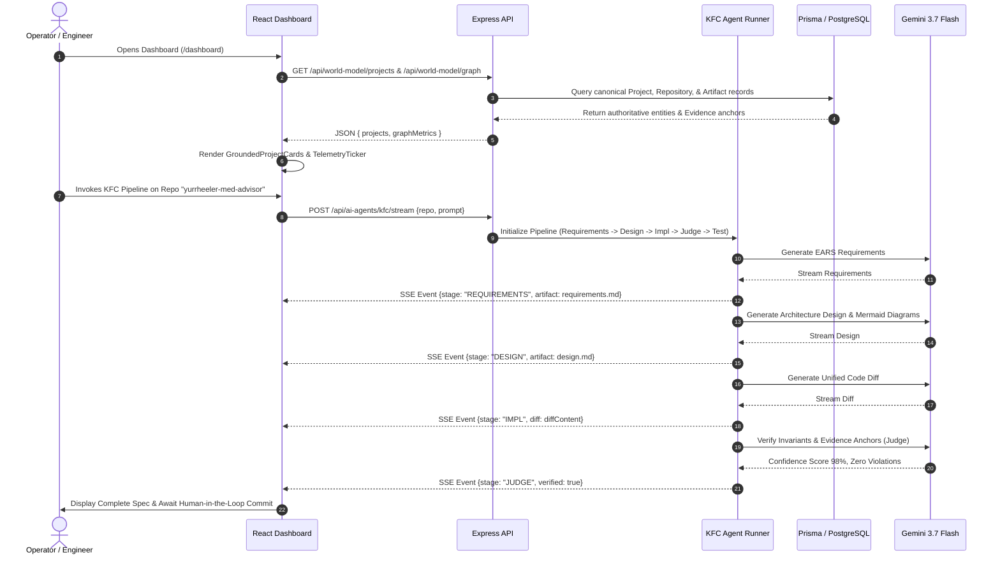

# Design Document: FeexSystems Next-Gen Engineering Architecture

## Overview
This design document establishes the concrete technical design for unifying the FeexSystems platform. It bridges the authoritative Prisma/PostgreSQL World Model with the authenticated SaaS dashboard (`/dashboard/*`), completes the Feex World OS // HoloKai 3D planetary terminal, activates the KFC autonomous multi-agent cockpit, grounds DevOps and security in the Evidence Fabric, and standardizes the Swiss Typographic Glassmorphic UI/UX system.

## Architecture Design

### System Architecture Diagram
```mermaid
graph TB
    subgraph ClientLayer [Client Browser: React 18 + Three.js + TailwindCSS 3]
        Router[React Router 7 Dual Mode]
        AuthGuard[Firebase Auth Guard]
        
        subgraph PublicExperiences [Public Living Spaces]
            IndexLanding[Landing & Sovereign Engine]
            GalaxyWorld[3D Spatial World / Galaxy]
            OmniStage[Omni-Command Stage]
            NavigatorRetriever[AI Grounded Navigator]
            EvidenceLedger[Evidence Fabric Ledger]
        end

        subgraph DashboardExperiences [Authenticated Operations]
            DashboardHome[Dashboard Home]
            KFCCockpit[KFC Multi-Agent Cockpit]
            ObservabilityView[AI Observability & Trace]
            DevOpsHub[DevOps & Webhooks]
            SecurityCenter[Security & Compliance]
            MarketingCenter[Marketing Digital Twin]
        end

        subgraph HoloKaiTerminal [HoloKai Terminal Subsystem]
            QCore[ExplodingArchitectureCore: 3D Q-Core]
            Satellites[8 Planetary Ecosystem Satellites]
            SwissHUD[Swiss Typographic Monochromatic HUD]
            SonikDSP[3WM Sonik Audio DSP]
            HoloKaiVoice[Gemini 3.7 Flash Voice Modal]
        end
    end

    subgraph ServerLayer [Express 5 API & Worker Services]
        WMController[/api/world-model/*]
        KFCController[/api/ai-agents/kfc/*]
        DevOpsController[/api/devops/*]
        SecurityController[/api/security/*]
        SSEBroadcaster[/api/world-model/telemetry/stream]
        
        subgraph CoreServices [Authoritative Services]
            WMService[World Model Service]
            EvidenceService[Evidence Fabric Ledger]
            KFCPipeline[KFC Multi-Agent Runner]
            GeminiClient[Gemini Interactions API Adapter]
            WebhookHandler[GitHub Webhook HMAC Verifier]
        end
    end

    subgraph DataLayer [Canonical Persistence]
        PostgreSQL[(PostgreSQL 15+ via Prisma)]
        RedisCache[(Redis & Bull Queues)]
    end

    PublicExperiences <--> HoloKaiTerminal
    DashboardExperiences <--> HoloKaiTerminal
    PublicExperiences --> WMController
    DashboardExperiences --> ServerLayer
    ServerLayer --> CoreServices
    CoreServices --> DataLayer
```

### Data Flow Diagram


## Component Design

### 1. GroundedProjectCard (`client/components/dashboard/GroundedProjectCard.tsx`)
- **Responsibilities**: Displays an individual World Model project anchored in real GitHub commit history and Evidence Fabric provenance.
- **Interfaces**:
  ```typescript
  export interface GroundedProjectCardProps {
    project: WorldModelProject;
    onExplore3D?: (projectId: string) => void;
  }
  ```
- **Dependencies**: Lucide icons, Radix UI, TailwindCSS 3.

### 2. KFCPipelineCockpit (`client/components/dashboard/KFCPipelineCockpit.tsx`)
- **Responsibilities**: Provides visual interactive execution and artifact review for the 5-stage KFC agent pipeline (`spec-requirements`, `spec-design`, `spec-impl`, `spec-judge`, `spec-test`).
- **Interfaces**:
  ```typescript
  export interface KFCPipelineCockpitProps {
    defaultRepository?: string;
  }
  ```

### 3. GlobalHoloKaiHotbar (`client/components/sovereign/GlobalHoloKaiHotbar.tsx`)
- **Responsibilities**: Ambient persistent HUD bar allowing instant `Ctrl+V` voice or text activation of the HoloKai Gemini agent across any dashboard view.

### 4. Swiss Typographic HUD Modernization (`client/components/sovereign/SovereignHUD.tsx`)
- **Responsibilities**: Enforces high-contrast `#00ff41` phosphor styling, radar circular reticle (350px), live hexadecimal crawl, corner brackets, and scanlines.

## Data Model

```typescript
export interface WorldModelProject {
  id: string;
  name: string;
  repository: string;
  description: string | null;
  url: string;
  isPinned: boolean;
  domain: string;
  language: string;
  artifactCount: number;
  lastObservedAt: string;
  metadata?: {
    topics?: string[];
    stars?: number;
    defaultBranch?: string;
  };
}

export type KFCPipelineStage = "REQUIREMENTS" | "DESIGN" | "IMPL" | "JUDGE" | "TEST" | "COMPLETE";

export interface KFCStageArtifact {
  stage: KFCPipelineStage;
  title: string;
  markdownContent: string;
  timestamp: string;
  confidenceScore?: number;
  diffContent?: string;
  status: "pending" | "running" | "approved" | "rejected";
}
```

## Error Handling Strategy
1. **SSE Telemetry Disconnection**: If `/api/world-model/telemetry/stream` closes or errors, the UI falls back to an internal procedural generator without flashing or crashing the dashboard.
2. **KFC Agent Invariant Violation**: If the Judge agent flags a violation of FeexSystems canonical principles (e.g. hallucinating ungrounded libraries), the stage status transitions to `rejected` with actionable diff remediation.
3. **Web Speech API Fallback**: If the browser lacks speech recognition or synthesis, HoloKai automatically opens with focused monospace command line input.
