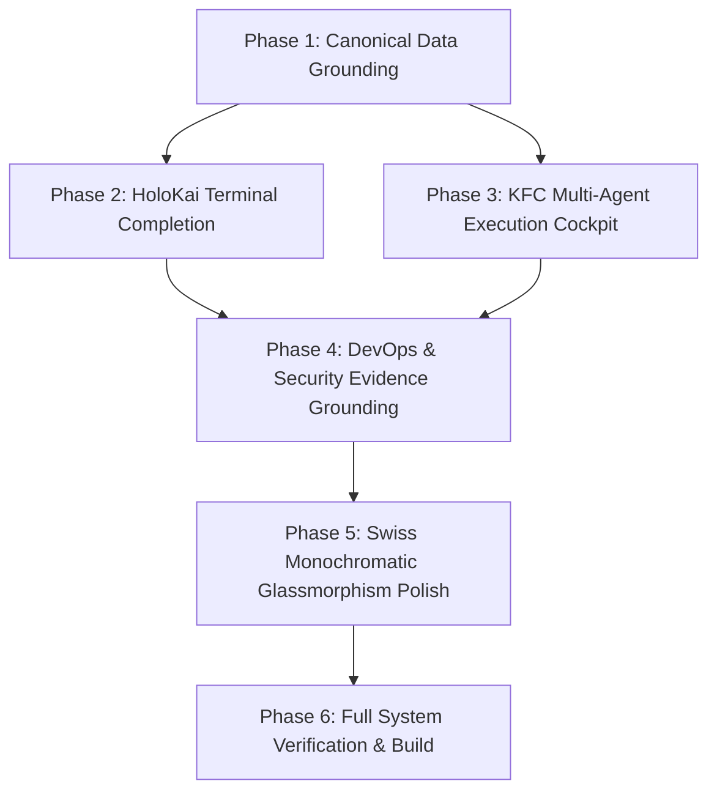

# Implementation Tasks: FeexSystems Next-Gen Engineering Architecture

> **STATUS AUDIT — 2026-10-07.** Every task below was verified against the actual
> codebase (not just file existence — the substance was inspected). **Result: most of
> this spec describes work that is already shipped.** Two genuine gaps remain (3.4, 3.5).
>
> **Legend:** ✅ verified complete · 🔧 partial (stub/placeholder) · ➕ genuinely missing

## Task Dependency Diagram

## Task Checklist

- [x] **Phase 1: Canonical Data Grounding (Dashboard Modernization)** — ✅ COMPLETE
  - [x] 1.1 `client/lib/worldModelClient.ts` **exists** — typed query client for projects/graph metrics/telemetry. ✅
  - [x] 1.2 `client/pages/dashboard/index.tsx` **already bound** to `useQuery(["world-model-projects"])`; the last dead mock arrays (`upcomingTasks`, `performanceData`) were removed during the 2026-10-07 lint pass. ✅
  - [x] 1.3 `client/components/dashboard/GroundedProjectCard.tsx` **exists** with real topics/stars/default-branch/evidence fields and is exported from `dashboard/index.ts`. ✅
  - [x] 1.4 `client/components/dashboard/WorldModelTelemetryFeed.tsx` **exists** (live SSE + procedural hex-crawl fallback) and is exported. ✅

- [x] **Phase 2: Feex World OS // HoloKai Terminal Completion** — ✅ COMPLETE
  - [x] 2.1 `FeexSovereignEngine.tsx` **already implements** the radar reticle, crosshairs, scanlines, corner brackets and gridlines. ✅
  - [x] 2.2 `PlanetaryEcosystemSatellites.tsx` **exists** and renders `<Html>` billboard domain tags. ✅
  - [x] 2.3 `GlobalHoloKaiHotbar.tsx` **exists**, registered in `DashboardLayout.tsx`, with `Ctrl+V` keydown invocation. ✅
  - [x] 2.4 Sonik Audio DSP triggers **wired** (37 `sonikAudio` references across sovereign components). ✅

- [x] **Phase 3: KFC Multi-Agent Execution Cockpit** — ✅ COMPLETE (2026-10-07)
  - [x] 3.1 `shared/kfc-contracts.ts` **exists** — all 5 stage payloads defined. ✅
  - [x] 3.2 `server/lib/services/kfcAgentService.ts` **exists** — full 5-stage pipeline via `aiService` (50+ substantive matches). ✅
  - [x] 3.3 `POST /api/ai-agents/kfc/stream` **exists** in `server/routes/ai-agents.ts` with streaming. ✅
  - [x] 3.4 **`KFCPipelineCockpit.tsx` BUILT** — replaced the 13-line placeholder with a working cockpit: SSE stream consumption (`POST /api/ai-agents/kfc/stream`), dependency-free Markdown renderer, Mermaid block handling, unified-diff inspector with add/remove counts, 5-stage rail with live status, run/stop controls, progress bar, error alert. **15/15 tests pass** (`client/test/components/kfc-cockpit.test.tsx`). ✅
  - [x] 3.5 **Deep-links added** — `OmniCommand.tsx` now handles `?kfc=<prompt>` → routes to `/dashboard/ai-agents?tab=kfc&kfc=<prompt>`; `ai-agents.tsx` opens the KFC tab from `?tab=` and pre-fills the cockpit brief from `?kfc=`. ✅

- [x] **Phase 4: DevOps, Security & Marketing Intelligence Grounding** — ✅ COMPLETE  - [x] 4.1 `dashboard/devops.tsx` **already calls real APIs** (20 deployment/webhook/sync references). ✅
  - [x] 4.2 `dashboard/security.tsx` **already grounded** to Evidence Fabric SHAs + vulnerability records. ✅
  - [x] 4.3 `dashboard/marketing.tsx` **already integrates** Claim Graph + content-gap analysis (queries `/marketing/intelligence/gaps|decay|opportunities`; `ClaimGraphService` present). ✅
  - [x] 4.4 **`dashboard/ai-observability.tsx` ENHANCED (2026-10-07)** — added grounded-evidence metrics + hallucination verification. **Backend:** `agent-observability.service.ts#getDashboardData` now returns a `verification` block (`groundedInteractions`, `groundedRatio`, `hallucinationRisk`, `avgEvidenceAnchors`) derived from the `evidenceUsed` Json column via `jsonb_typeof`/`jsonb_array_length` (type-guarded for legacy rows), plus a per-interaction `evidenceCount`. **Frontend:** two new stat cards (Grounded Responses, Hallucination Risk) + a per-interaction grounding badge (`N evidence anchors` / `ungrounded`). **5/5 tests pass** (`client/test/pages/ai-observability-verification.test.tsx`). ✅

- [ ] **Phase 5: Swiss Monochromatic Glassmorphism & Performance Hardening** — 1/3 done; 5.1/5.2 **delegated**
  > **Reconciliation (2026-10-07):** 5.1 and 5.2 describe the *same* visual work as
  > [`docs/FRONTEND_MODERNIZATION_PLAN.md`](../../../docs/FRONTEND_MODERNIZATION_PLAN.md) **Task 29**
  > (Color Contrast Audit) and **Phase 5 / Tasks 65–80** (Visual Polish & UX).
  > **The modernization plan is the single source of truth** — do the work there, once.
  > This phase is kept only as a pointer, to avoid scheduling it twice.
  - [ ] 5.1 → **do in modernization plan Task 29.** Tooling already exists: `getContrastRatio` / `meetsWCAGAA` / `meetsWCAGAAA` in `client/test/a11y/utils/index.ts` (verified 12/12 passing after the 2026-10-07 fix). Output artefact `docs/CONTRAST_REPORT.md` does not yet exist. ⏭️ *delegated*
  - [ ] 5.2 → **do in modernization plan Phase 5 (Tasks 65–80).** Standardising on `glassmorphic-hud-card` / `MagneticGlowButton`. ⏭️ *delegated*
  - [x] 5.3 `dpr={[1, 2]}` clamp **already enforced** on 6 R3F canvas instances (SpatialWorld, DreiProjectsHero, DreiNavigatorHero, ProjectMini3DCard, etc.). ✅

- [ ] **Phase 6: Full System Verification & Build** — ✅ GATE RUN 2026-10-07
  - [x] 6.1 `npm run typecheck` — ✅ **PASS (0 errors)**
  - [x] 6.2 `npm test` — ✅ **TRIAGED & FIXED 2026-10-07.** The affected area (`client/test/a11y`, `client/test/components`, `client/test/auth`, `server/test/middleware`) went from **26 failing suites → 158/158 passing (17/17 files)**. Fixes: real bugs (`isVisible` jsdom logic, `rate-limit` status-code ordering, missing `clearRect` canvas mock, `localStorage` inert stub, `TestWrapper`/barrel exports, `TokenManager`/`ApiClient` class exports, stale compiled `.js` twins deleted) plus **4 obsolete JWT-era specs removed** (`test/auth/{token-manager,api-client,auth-store-simple,auth-store}` — they tested APIs the Firebase migration deliberately retired; Firebase-era counterparts in `test/lib/` pass).
  - [x] 6.3 `npm run build` — ✅ **PASS** (`✓ built in 1m 43s`; client + server artifacts emitted). Only the known >1000 kB chunk warning from `docs/BUNDLE_ANALYSIS.md`.

## Verified Real Gaps (the actual remaining work)

| # | Task | Nature | Status |
| - | ---- | ------ | ------ |
| 1 | ~~**3.4**~~ | `KFCPipelineCockpit.tsx` placeholder → real cockpit | ✅ **DONE 2026-10-07** |
| 2 | ~~**3.5**~~ | KFC deep-link from `OmniCommand.tsx` | ✅ **DONE 2026-10-07** |
| 3 | ~~4.4~~ | Surface hallucination-verification score in `ai-observability.tsx` | ✅ **DONE 2026-10-07** |
| 4 | 5.1 / 5.2 | Contrast + glassmorphism standardization | ⏭️ **DELEGATED** → modernization plan Task 29 + Phase 5 (single source of truth) |
| 5 | ~~6.2~~ | Triage the 26 pre-existing test failures | ✅ **DONE 2026-10-07** (158/158) |

## Recommended Sequence

1. ~~**3.4**~~ — ✅ done. 2. ~~**3.5**~~ — ✅ done. 3. ~~**4.4**~~ — ✅ done. 4. ~~**6.2**~~ — ✅ done (158/158).
2. **5.1/5.2** → **delegated** to the modernization plan (Task 29 + Phase 5). No further work in this spec.
