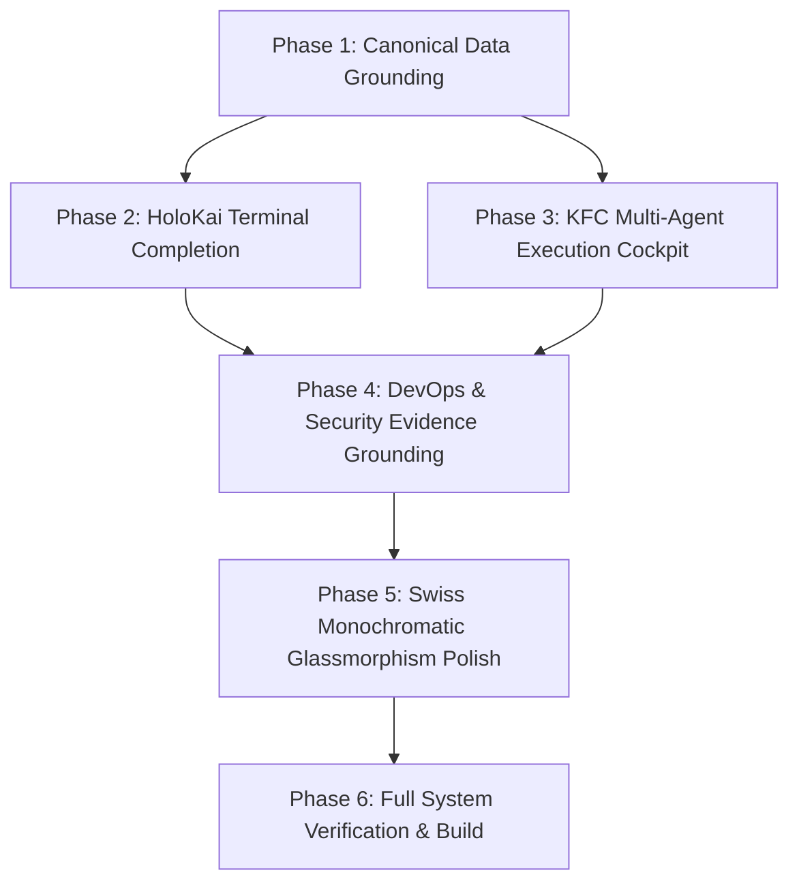

# Implementation Tasks: FeexSystems Next-Gen Engineering Architecture

## Task Dependency Diagram

## Task Checklist

- [ ] **Phase 1: Canonical Data Grounding (Dashboard Modernization)**
  - [ ] 1.1 Create `client/lib/worldModelClient.ts` with typed queries for projects, graph metrics, and live SSE telemetry.
  - [ ] 1.2 Refactor `client/pages/dashboard/index.tsx` to eliminate hardcoded mock arrays and bind to `useQuery(['world-model-projects'])`.
  - [ ] 1.3 Implement `client/components/dashboard/GroundedProjectCard.tsx` featuring real GitHub topics, stars, default branches, and Evidence Fabric links.
  - [ ] 1.4 Implement `client/components/dashboard/WorldModelTelemetryFeed.tsx` displaying live SSE events or procedural hex crawl.

- [ ] **Phase 2: Feex World OS // HoloKai Terminal Completion**
  - [ ] 2.1 Complete Task 4 in `client/components/sovereign/FeexSovereignEngine.tsx` — 40px gridlines, corner brackets, 350px radar reticle with crosshairs, and scanlines.
  - [ ] 2.2 Integrate `PlanetaryEcosystemSatellites.tsx` into the 3D scene with Swiss HTML billboard tags for all 8 domains.
  - [ ] 2.3 Build `client/components/sovereign/GlobalHoloKaiHotbar.tsx` and register in `DashboardLayout.tsx` for universal keyboard (`Ctrl+V`) and click invocation.
  - [ ] 2.4 Connect Sonik Audio DSP triggers for node clicks and telemetry status shifts.

- [ ] **Phase 3: KFC Multi-Agent Execution Cockpit**
  - [ ] 3.1 Create `shared/kfc-contracts.ts` defining stage payloads (Requirements, Design, Impl, Judge, Test).
  - [ ] 3.2 Create backend service `server/lib/services/kfcAgentService.ts` running the 5-stage pipeline via `aiService` (Gemini 3.7 Flash).
  - [ ] 3.3 Add streaming endpoint `POST /api/ai-agents/kfc/stream` in `server/routes/ai-agents.ts`.
  - [ ] 3.4 Create `client/components/dashboard/KFCPipelineCockpit.tsx` featuring live Markdown rendering, Mermaid diagrams, and unified diff inspector.
  - [ ] 3.5 Integrate the cockpit into `client/pages/dashboard/ai-agents.tsx` and add deep-links to `client/pages/OmniCommand.tsx`.

- [ ] **Phase 4: DevOps, Security & Marketing Intelligence Grounding**
  - [ ] 4.1 Connect `client/pages/dashboard/devops.tsx` to real repository deployments and webhook sync logs.
  - [ ] 4.2 Connect `client/pages/dashboard/security.tsx` to Evidence Fabric commit SHAs and vulnerability scan records.
  - [ ] 4.3 Integrate Claim Graph visualization and content gap analysis into `client/pages/dashboard/marketing.tsx`.
  - [ ] 4.4 Enhance `client/pages/dashboard/ai-observability.tsx` with grounded evidence metrics and hallucination verification scores.

- [ ] **Phase 5: Swiss Monochromatic Glassmorphism & Performance Hardening**
  - [ ] 5.1 Audit and upgrade contrast across all muted/subtle typography in `client/global.css` and layout components.
  - [ ] 5.2 Standardize button and panel glassmorphism using `glassmorphic-hud-card` and `MagneticGlowButton`.
  - [ ] 5.3 Enforce `dpr={[1, 2]}` clamp on all Three.js R3F Canvas instances (`SpatialWorld.tsx`, `SovereignScene.tsx`, `DreiProjectsHero.tsx`).

- [ ] **Phase 6: Full System Verification & Build**
  - [ ] 6.1 Run TypeScript typecheck (`npm run typecheck`).
  - [ ] 6.2 Run Vitest test suite (`npm test`).
  - [ ] 6.3 Run production build (`npm run build`).
