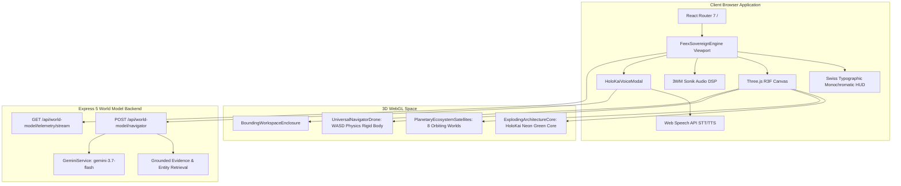
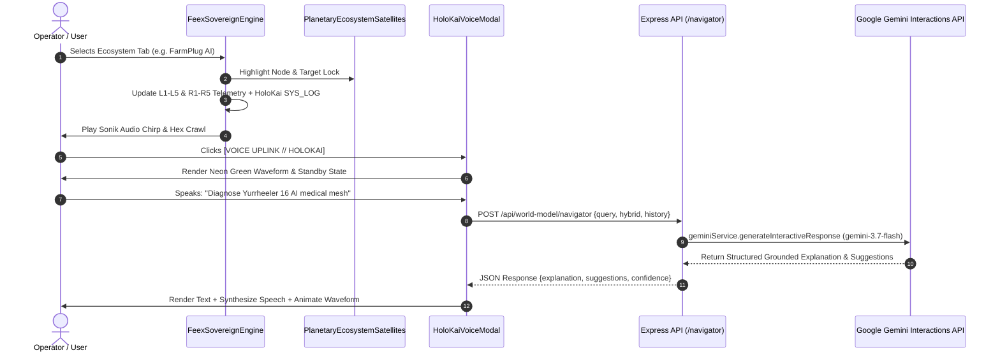

# Design Document: Feex World OS // HoloKai Uplink Terminal

## Overview
The Feex World OS // HoloKai Uplink transforms the FeexSystems landing experience into an operational planetary command console. It pairs a Three.js 3D planetary ecosystem (Q-Core surrounded by 8 orbiting satellites) with a Swiss Typographic HUD, audio DSP synthesis, and a Google Gemini Interactive API voice/text modal.

## Architecture Design

### System Architecture Diagram


### Data Flow Diagram


## Component Design

### 1. FeexSovereignEngine
- **Responsibilities**: Orchestrates the full-screen terminal viewport, Swiss Typographic HUD, header navigation, telemetry panels, reticle, scanlines, and 3D Canvas.
- **Interfaces**:
  ```typescript
  export interface FeexSovereignEngineProps {
    onSwitchToDossier?: () => void;
  }
  ```
- **Dependencies**: `@react-three/fiber`, `@react-three/drei`, `lucide-react`, `sonikAudio`.

### 2. PlanetaryEcosystemSatellites
- **Responsibilities**: Renders 8 distinct orbiting ecosystem nodes around the central Q-Core with 3D HTML Swiss Typographic labels.
- **Interfaces**:
  ```typescript
  export interface PlanetaryEcosystemSatellitesProps {
    selectedId: string | null;
    onSelect: (satellite: EcosystemSatellite) => void;
  }
  ```
- **Dependencies**: `@react-three/fiber`, `@react-three/drei`, `three`.

### 3. HoloKaiVoiceModal
- **Responsibilities**: Modal console for voice recognition (STT), audio waveform visualization, Gemini Interactions API communication, and vocal playback (TTS).
- **Interfaces**:
  ```typescript
  export interface HoloKaiVoiceModalProps {
    isOpen: boolean;
    onClose: () => void;
    activeEcosystem?: string;
  }
  ```
- **Dependencies**: Web Speech API (`SpeechRecognition`, `speechSynthesis`), HTML5 Canvas, `/api/world-model/navigator`.

### 4. ExplodingArchitectureCore
- **Responsibilities**: The 7-tier modular engine stack adhering strictly to monochromatic wireframe styling with the `#00ff41` neon green icosahedron core.

## Data Model

```typescript
export interface EcosystemSatellite {
  id: string;
  name: string;
  category: string;
  tagline: string;
  status: string;
  metrics: {
    l1: string;
    l2: string;
    r1: string;
    r2: string;
  };
  sysLog: string;
}

export interface VoiceChatMessage {
  role: "user" | "holokai";
  text: string;
  timestamp: string;
  confidence?: number;
  suggestions?: string[];
}
```

## Business Process

### Process 1: Ecosystem Selection & Target Lock
1. Operator clicks an ecosystem in the header bar or clicks the 3D satellite node.
2. System sets `selectedSatellite` state and triggers `sonikAudio.playNodeImpact`.
3. HUD immediately maps `selectedSatellite.metrics` into `[L1-L5]` and `[R1-R5]`.
4. HoloKai `SYS_LOG` updates with the domain's operational telemetry.

### Process 2: Gemini Voice & Text Interaction
1. Operator opens `HoloKaiVoiceModal`.
2. Operator clicks mic button; Web Speech API captures voice and animates the `#00ff41` canvas waveform.
3. On transcription end, request is posted to `POST /api/world-model/navigator`.
4. Gemini 3.7 Flash generates grounded reasoning with suggestions.
5. Response is vocalized using Web Speech Synthesis; waveform visualizer animates with vocal amplitude.

## Error Handling Strategy
1. **Microphone Permission Denied / Unsupported**: Gracefully falls back to text command input with an inline status indicator.
2. **Gemini API Network Failure / Offline**: Falls back to the canonical World Model procedural simulation response without interrupting the UI session.
3. **Audio Synthesis Unavailability**: Web Speech Synthesis failures fail silently; text output remains 100% available.
