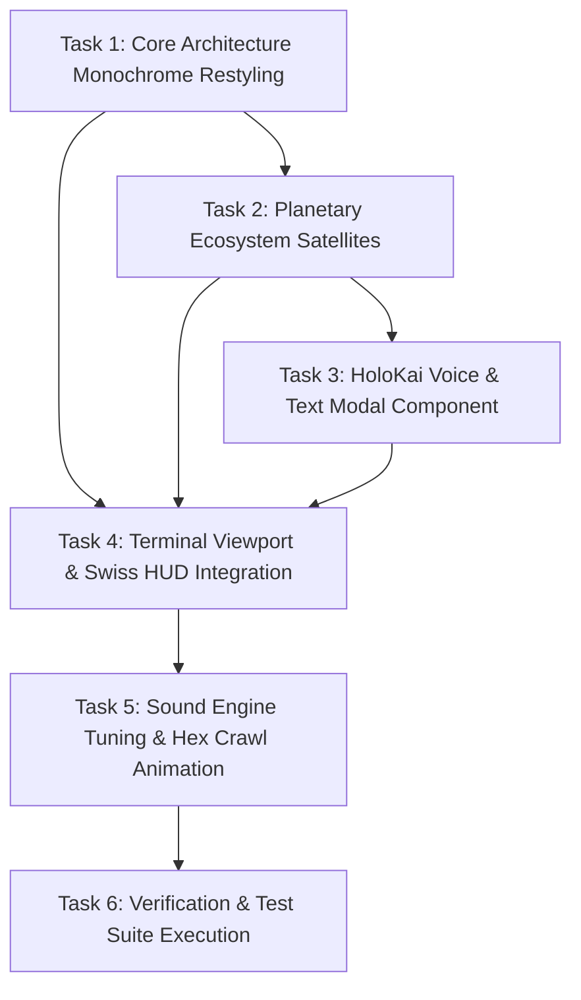

# Implementation Tasks: Feex World OS // HoloKai Uplink Terminal

## Task Dependency Diagram

## Task Checklist

- [x] **Task 1: Core Architecture Monochrome Restyling**
  - [x] 1.1 Update `ExplodingArchitectureCore.tsx` to strictly use monochrome wireframe geometry.
  - [x] 1.2 Set the central HoloKai Q-Core as pulsing `#00ff41` neon green icosahedron.
  - [x] 1.3 Remove multi-colored materials (cyan, magenta, gold) to enforce the Swiss clinical aesthetic.

- [x] **Task 2: Planetary Ecosystem Satellites**
  - [x] 2.1 Create `PlanetaryEcosystemSatellites.tsx` defining the 8 canonical domains:
    - 3WM DSP SONIK
    - YURRHEELER MED-NET
    - FARMPLUG AI
    - FIREHOUSE GRILLS
    - FEEXKEEAUTH SECURITY
    - KAPPAXCHANGEFIN
    - RENTALL SMARTS HOMES
    - FEEX WORLD OS / HOLOKAI
  - [x] 2.2 Implement 3D HTML Swiss Typographic billboard tags and target lock interactions.
  - [x] 2.3 Export component from `client/components/sovereign/index.ts`.

- [x] **Task 3: HoloKai Voice & Text Modal Component**
  - [x] 3.1 Create `HoloKaiVoiceModal.tsx` in `client/components/sovereign/`.
  - [x] 3.2 Implement HTML5 canvas oscilloscope waveform visualizer in `#00ff41`.
  - [x] 3.3 Wire Web Speech API (`SpeechRecognition` & `speechSynthesis`) for voice input/output.
  - [x] 3.4 Wire `POST /api/world-model/navigator` (Gemini Interactions API) for grounded cognition.
  - [x] 3.5 Export component from `client/components/sovereign/index.ts`.

- [ ] **Task 4: Terminal Viewport & Swiss HUD Integration**
  - [ ] 4.1 Update `FeexSovereignEngine.tsx` with Swiss Typographic HUD layout:
    - 40px background gridlines (`rgba(255, 255, 255, 0.03)`).
    - Top header: `FEEX WORLD OS // HOLOKAI UPLINK` with all 8 ecosystem pills + `[VOICE UPLINK // HOLOKAI]`.
    - Corner brackets (`::before`, `::after`) on panels.
    - Radar circular reticle (350px) with crosshairs and center green dot.
    - Animated horizontal scanline (`0.08` opacity).
  - [ ] 4.2 Connect telemetry panels `[L1-L5]` and `[R1-R5]` with live hexadecimal crawl.
  - [ ] 4.3 Mount `PlanetaryEcosystemSatellites` inside the 3D Canvas.
  - [ ] 4.4 Mount `HoloKaiVoiceModal` triggered by header button or terminal command.

- [ ] **Task 5: Sound Engine Tuning & Hex Crawl Animation**
  - [ ] 5.1 Ensure audio events trigger on satellite selection and telemetry shifts.
  - [ ] 5.2 Verify hex crawl timer updates values dynamically.

- [ ] **Task 6: Verification & Test Suite Execution**
  - [ ] 6.1 Run Vitest component tests on `FeexSovereignEngine.test.tsx`.
  - [ ] 6.2 Execute TypeScript typecheck (`npm run typecheck`).
  - [ ] 6.3 Verify live dev server at `http://localhost:8080/`.
