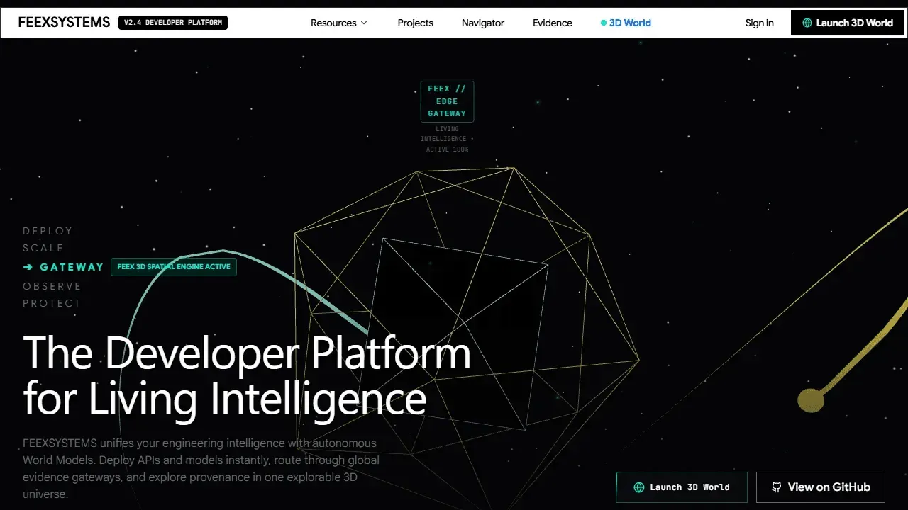
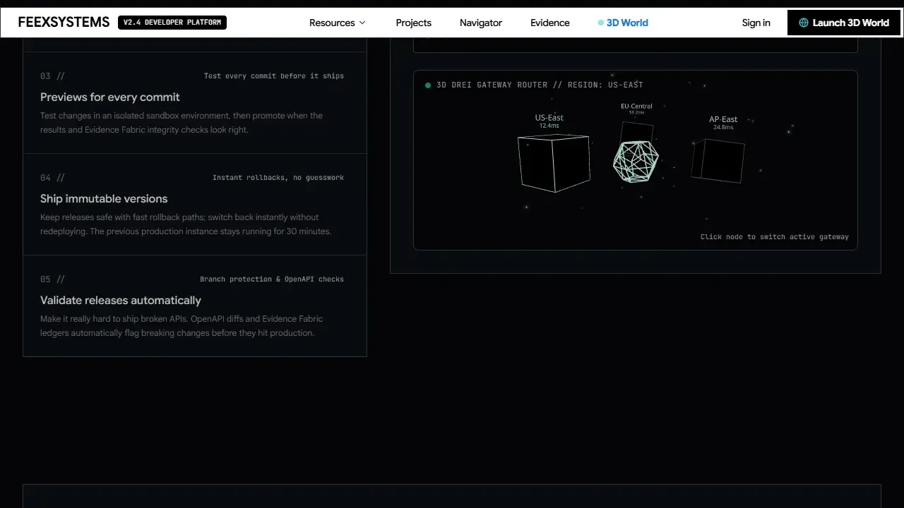

# FEEXSYSTEMS — Living Engineering Intelligence

<div align="center">

**An evidence-backed World Model that turns a living software ecosystem into an explorable intelligent world.**

[](https://feexsystems-prod-508304.web.app)
[](https://cloud.google.com/run)
[](https://cloud.google.com/sql)
[](https://threejs.org)
[](https://www.typescriptlang.org)

**[Live Experience](https://feexsystems-prod-508304.web.app)** · **[Spatial World](https://feexsystems-prod-508304.web.app/world)** · **[Navigator](https://feexsystems-prod-508304.web.app/navigator)** · **[Omni-Command](https://feexsystems-prod-508304.web.app/omni)** · **[Evidence Fabric](https://feexsystems-prod-508304.web.app/evidence)** · **[API Health](https://feexsystems-server-1098867692790.us-central1.run.app/health)**

</div>

---

## What Is FEEXSYSTEMS?

**FEEXSYSTEMS** is a living engineering intelligence system. It continuously transforms software-development evidence into a structured **World Model** that humans and AI systems can explore, query, inspect, and reason over.

The platform treats repositories, artifacts, technologies, relationships, commits, deployments, and temporal state as connected system entities rather than isolated documents.

It is deliberately **not**:

- a conventional code-search interface;
- a static portfolio;
- an LLM wrapper around a document store;
- a documentation generator;
- a decorative 3D visualization.

It is an **evidence-backed engineering intelligence substrate** with a spatial interface.

> **The LLM interprets the World Model. It does not become the World Model.**

Canonical reality lives in structured, evidence-backed system state. Models reason over that state; they do not silently replace it.

---

## Enter the World

<div align="center">

### The Spatial World

[](https://feexsystems-prod-508304.web.app/world)

**Explore the engineering graph as a spatial system.**

Projects, technologies, artifacts, and relationships are projected into a Three.js/WebGL environment where spatial position carries graph meaning.

**[Open Spatial World →](https://feexsystems-prod-508304.web.app/world)**

### The Navigator

[](https://feexsystems-prod-508304.web.app/navigator)

**Ask questions against grounded system state.**

Navigator combines World Model retrieval, evidence provenance, graph relationships, and model-backed reasoning rather than treating the LLM as the source of truth.

**[Open Navigator →](https://feexsystems-prod-508304.web.app/navigator)**

</div>

---

## From Repository to Intelligence

FEEXSYSTEMS follows a traceable chain from engineering evidence to machine-assisted understanding:

```text
Repository
    ↓
Artifact
    ↓
Technology
    ↓
Relationship
    ↓
Evidence
    ↓
Commit
    ↓
Temporal State
    ↓
World Model
    ↓
Navigator
    ↓
Intelligence
```

The important boundary is intentional:

```text
GitHub Evidence
      │
      ▼
   Ingestion
      │
      ▼
Evidence Fabric
      │
      ▼
  World Model
      │
 ┌────┴──────────────┐
 ▼                   ▼
Embeddings        Graph Traversal
 │                   │
 └────────┬──────────┘
          ▼
      Navigator
          │
          ▼
   Model-backed Reasoning
          │
   ┌──────┼────────┐
   ▼      ▼        ▼
 Spatial  Omni    Voice
 World  Command
```

---

## The World Model

The World Model is the canonical system representation behind the public experience.

### Canonical entities

- **Projects** — coherent system-level products and worlds.
- **Repositories** — source-control boundaries and GitHub evidence sources.
- **Artifacts** — files, manifests, specifications, deployments, and other discoverable system objects.
- **Technologies** — frameworks, runtimes, infrastructure, databases, AI providers, and tooling.
- **Relationships** — typed connections such as `HAS_REPOSITORY`, `CONTAINS`, `USES`, and `DEPENDS_ON`.
- **Evidence** — repository, branch, commit SHA, path, line range, artifact URL, and observation time.
- **Temporal state** — reconstructable system state associated with commits and timestamps.

The World Model is therefore more than a graph visualization: it is the structured reality over which retrieval, explanation, navigation, and reasoning operate.

---

## The Intelligence Stack

### 1. World Model

The canonical representation of the FeexSystems ecosystem. Structured entities and typed relationships provide the foundation for all downstream intelligence.

### 2. Evidence Fabric

A provenance layer connecting claims and relationships to verifiable engineering evidence such as GitHub repositories, commits, paths, line ranges, artifact URLs, and observation timestamps.

### 3. Navigator

The grounded retrieval and explanation layer. It combines semantic retrieval and graph-aware context so answers can be traced back to the system state that supports them.

### 4. Omni-Command

A multi-modal command surface for orchestrating World Model interactions. The production architecture uses validated orchestration contracts and streaming SSE execution traces.

### 5. Spatial World

A Three.js/WebGL projection of graph topology. Spatial relationships communicate system structure rather than serving as decoration.

### 6. Living Intelligence

Ambient model-backed assistance that operates over the World Model and can degrade gracefully when remote intelligence is unavailable.

---

## The Living Ecosystem

FEEXSYSTEMS is designed to represent an ecosystem of connected system worlds, including:

| World / System | Role |
|---|---|
| **Persona OS** | Interactive persona and digital-world operating environment |
| **Yurrheeler AI** | Specialized healthcare intelligence system |
| **3WM Sonik Labs** | AI-native audio and creative intelligence |
| **HoloKai** | Cultural intelligence and spatial world-model systems |
| **KappaXchangeFin** | Financial infrastructure and exchange systems |
| **VYRA Labs** | Conversational interfaces and intelligent media |
| **Rental Paradise** | Property discovery and digital commerce |

The repository's World Model is intended to expose these systems as connected evidence-backed entities rather than a flat portfolio list.


---

## Evidence & Trust

FEEXSYSTEMS is built around an evidence-first engineering model.

```text
Source
  ↓
Verify
  ↓
Store
  ↓
Trace
  ↓
Reason
```

### Evidence principles

- **Repository-grounded** — system facts originate from identifiable source material.
- **Commit-aware** — evidence can be anchored to Git commit state.
- **Path-aware** — claims can point toward concrete files and artifacts.
- **Temporal** — system state can be reasoned about across historical observations.
- **Inspectable** — the platform exposes provenance rather than hiding it behind a generated answer.

The Evidence Fabric is the trust boundary between canonical system state and model-backed interpretation.

---

## Seven Canonical Invariants

The platform's architecture is governed by seven invariants:

| # | Invariant | Contract |
|---|---|---|
| **1** | **World Model is Authoritative** | The database-backed World Model is canonical. Models interpret and summarize; they do not silently invent canonical facts. |
| **2** | **Evidence Fabric Provenance** | Claims and relationships are anchored to verifiable evidence. |
| **3** | **Non-Blocking Infrastructure Initialization** | Database, Redis, and third-party connections must not block server boot or readiness. |
| **4** | **Provider-Neutral Intelligence** | AI interactions use provider-agnostic service abstractions so model providers can change without breaking application contracts. |
| **5** | **Browser as Projection** | The browser is a read projection; canonical state lives server-side and synchronizes through API/SSE boundaries. |
| **6** | **Dual Mode Routing** | Public experience routes remain accessible to guests; authentication routes handle identity-specific flows. |
| **7** | **3D Spatial Meaning** | Spatial rendering communicates topology, clustering, and relationships rather than existing only for visual effect. |

---

## System Architecture

The production topology currently centers on Firebase Hosting, Google Cloud Run, Cloud SQL/PostgreSQL, Redis, model services, and Google Cloud observability.

```text
                         Public User
                              │
                              ▼
                  Firebase Hosting / Edge
                              │
              ┌───────────────┴───────────────┐
              ▼                               ▼
       React / Vite / Three.js          Cloud Run / Express
              │                               │
              │                    ┌──────────┼──────────┐
              │                    ▼          ▼          ▼
              │                 Cloud SQL   Redis      AI Services
              │                 PostgreSQL  / Queues   / Embeddings
              │                    │          │          │
              └────────────────────┴──────────┴──────────┘
                                      │
                                      ▼
                              Observability Layer
                           Logs · Analytics · Artifacts
```

### Production components

- **Presentation:** React 18, Vite, React Router, TailwindCSS, Radix UI, Three.js.
- **Compute:** Express 5 on Google Cloud Run.
- **Data:** PostgreSQL 15 with pgvector on Cloud SQL.
- **In-memory services:** Redis/TLS for queues, sessions, rate limiting, and pub/sub.
- **AI:** Provider-neutral application abstractions with the production Gemini integration described by the current runtime.
- **Analytics:** BigQuery event and telemetry pipelines.
- **Artifacts:** Google Cloud Storage for evidence and artifact snapshots.
- **Secrets:** Google Cloud Secret Manager.
- **Observability:** Google Cloud logging and operational telemetry.

---

## Security & Trust Model

Security is treated as part of the World Model boundary rather than a separate afterthought.

### Source → Verify → Store → Trace → Reason

1. **Source** — identify the originating repository, event, artifact, or runtime observation.
2. **Verify** — validate webhook signatures and other source-integrity controls.
3. **Store** — persist canonical state and evidence in controlled infrastructure.
4. **Trace** — retain provenance identifiers and temporal context.
5. **Reason** — allow model-backed services to interpret retrieved state without replacing it.

### Current security controls documented by the repository

- No plaintext production secrets committed to source.
- Production credentials managed through Google Cloud Secret Manager.
- GitHub webhooks verified using HMAC-SHA256.
- Private database connectivity is used in the documented production architecture.
- JWT/Firebase identity controls are part of the API security layer.
- Helmet-based security headers are applied by the production Express server.
- Production containers run as an unprivileged user.

---

## Technology Stack

| Layer | Technologies |
|---|---|
| **Frontend** | React 18, Vite, React Router, TailwindCSS, Radix UI |
| **Spatial** | Three.js, WebGL, @react-three/fiber |
| **Backend** | Node.js, Express 5, TypeScript |
| **Data** | PostgreSQL 15, Prisma, pgvector |
| **Retrieval** | Vector similarity + full-text / graph-aware retrieval |
| **AI** | Provider-neutral AI service abstraction; Gemini integration in current production architecture |
| **Queues / Cache** | Redis, BullMQ |
| **Cloud** | Google Cloud Run, Cloud SQL, Cloud Storage, BigQuery, Secret Manager |
| **Edge** | Firebase Hosting |
| **CI/CD** | Google Cloud Build |
| **Testing** | Vitest, Prisma/Firebase test doubles as documented by the repository |
| **Automation** | Airflow / scheduled reconciliation pipelines |

---

## Repository Architecture

```text
FeexSystems-Living-Intelligence-World/
├── client/                         # React SPA and spatial experience
│   ├── components/
│   │   ├── omni/                  # Omni-Command UI
│   │   ├── security/              # Security dashboards
│   │   ├── webgl/                 # Three.js scenes
│   │   ├── ui/                    # Shared UI primitives
│   │   └── Bushfeexer.tsx         # Living Intelligence interface
│   ├── hooks/                      # Client interaction and auth hooks
│   ├── lib/                       # Client adapters/utilities
│   ├── pages/                     # Product routes
│   ├── App.tsx                    # Router/application root
│   └── global.css                 # Design tokens/theme
├── server/                        # Express backend
│   ├── lib/                       # Core services and middleware
│   ├── routes/                    # API controllers
│   ├── test/                      # Test infrastructure
│   └── index.ts                   # Server entrypoint
├── shared/                        # Shared TypeScript contracts
├── prisma/                        # PostgreSQL schema and migrations
├── pipelines/                     # Data engineering / Airflow
├── scripts/                       # Deployment and operational scripts
├── docs/                          # Technical and brand documentation
├── Dockerfile                     # Production container
├── firebase.json                  # Hosting and routing configuration
├── cloudbuild.yaml                # CI/CD pipeline
└── package.json                   # Project dependencies and scripts
```

> **Documentation rule:** as FEEXSYSTEMS evolves toward autonomous ingestion and World Model maintenance, the repository tree and architecture docs should be generated or periodically verified against the source tree. Stale documentation conflicts directly with the system's evidence-first doctrine.

---

## Developer Quickstart

### Prerequisites

- Node.js 20.x or 22.x LTS
- npm 10+
- PostgreSQL 15+ with pgvector
- Redis 7+

### Install

```bash
git clone https://github.com/FeexSystems/FeexSystems-Living-Intelligence-World.git
cd FeexSystems-Living-Intelligence-World
npm install
```

### Configure

```bash
cp .env.example .env
```

Configure the environment for local development. The exact variable names and integrations should be taken from the repository's current `.env.example` and deployment configuration rather than copied from this document as secrets.

### Initialize

```bash
npx prisma generate
npm run db:init
```

### Run

```bash
npm run dev
```

Expected local experience:

- Application: `http://localhost:8080`
- Health: `http://localhost:8080/health`
- Spatial World: `http://localhost:8080/world`

### Validate

```bash
npm run typecheck
npm test
npm run build
```

---

## API Surface

The public README intentionally exposes the architectural API surface without duplicating the entire backend contract.

| Method | Endpoint | Purpose |
|---|---|---|
| `GET` | `/health` | Deep service/dependency health |
| `GET` | `/api/world-model/projects` | World Model project inventory |
| `GET` | `/api/world-model/graph` | Graph topology |
| `GET` | `/api/world-model/navigator?q=:query` | Grounded Navigator retrieval |
| `GET` | `/api/world-model/evidence/:projectId` | Evidence retrieval |
| `GET` | `/api/world-model/temporal/:projectId` | Historical state reconstruction |
| `POST` | `/api/world-model/omni-command` | Orchestration contract |
| `POST` | `/api/world-model/omni-command/stream` | SSE execution stream |
| `POST` | `/api/world-model/webhook` | GitHub webhook ingestion |

For the complete route contract, inspect the server route definitions and shared schemas in the repository.

---

## Production Deployment

The documented deployment path is:

```text
Commit / Merge
     ↓
Cloud Build
     ↓
Typecheck + Tests
     ↓
Container Build
     ↓
Cloud Run Deployment
     ↓
Firebase Hosting
     ↓
Live Experience
```

### Backend

```powershell
.\scripts\deploy-cloud-run.ps1 -ProjectId "feexsystems-prod-508304" -Region "us-central1"
```

### Frontend

```bash
npm run build
firebase deploy --only hosting
```

Production changes should be verified through health probes, browser smoke tests, and the live public routes before being considered complete.

---

## Operations & Living Synchronization

FEEXSYSTEMS is designed to remain synchronized with its source ecosystem.

Documented operational capabilities include:

- GitHub webhook ingestion and verification.
- Scheduled repository reconciliation.
- Incremental World Model updates.
- Embedding regeneration.
- Orphan cleanup and graph maintenance.
- BigQuery event telemetry.
- Evidence artifact storage.
- Temporal World Model reconstruction.

The long-term architecture extends this into continuous change detection, dependency-impact propagation, autonomous World Model maintenance, and event-driven intelligence.

---

## Visual Showcase

<div align="center">

| World Model | Navigator |
|:---:|:---:|
|  |  |

| Project Explorer | Workflow |
|:---:|:---:|
|  |  |

| Telemetry | Showcase |
|:---:|:---:|
|  |  |

</div>

More visual assets are maintained under `docs/brand-assets/screenshots/`.

---

## Documentation

The repository contains deeper material for architecture, deployment, specifications, and brand systems.

Recommended documentation hierarchy:

```text
docs/
├── architecture/
│   ├── world-model.md
│   ├── evidence-fabric.md
│   ├── navigator.md
│   ├── omni-command.md
│   └── spatial-world.md
├── engineering/
├── operations/
├── product/
└── brand/
    ├── identity.md
    ├── visual-system.md
    └── screenshots/
```

This target hierarchy is the documentation architecture for the next documentation-hardening pass; the current repository may still contain the legacy `docs/brand-assets/` structure.

---

## Brand System

The repository's canonical brand specification defines FEEXSYSTEMS as an architectural, evidence-oriented, graph-based and living visual system.

Core identity principles:

- **Architectural, not decorative**
- **Graph, not list**
- **Evidence, not claims**
- **Living substrate**

The canonical brand library defines the master mark, spatial visual language, telemetry components, child-world identity matrix, and FEEXSYSTEMS lexicon.

See: [Brand Assets Library](docs/brand-assets/FEEXSYSTEMS_Brand_Assets_Library.md)

---

## Engineering Doctrine

### Canonical Truth

The World Model is the system of record for machine-readable ecosystem state.

### Evidence Before Inference

Generated explanations should be grounded in retrieved evidence and identifiable system state.

### Models Are Interpreters

LLMs are reasoning components, not substitutes for the underlying World Model.

### Spatial UI Has Semantics

The 3D interface communicates topology, density, relationship, and focus.

### Living Systems Require Temporal Awareness

A current system state is not the only state that matters. Commits, events, observations, and mutations form a history.

### Documentation Is Part of the System

A living engineering intelligence platform must keep its public documentation synchronized with the reality it claims to model.

---

## License & Intellectual Property

**Proprietary software owned by FeexSystems. All rights reserved.**

- **Product:** FEEXSYSTEMS — Living Engineering Intelligence
- **Public Experience:** [feexsystems.codes](https://feexsystems.codes) / [production experience](https://feexsystems-prod-508304.web.app)
- **Organization:** FeexSystems

---

<div align="center">

**FEEXSYSTEMS**

*Living Engineering Intelligence*

**Repository → Evidence → World Model → Intelligence**

</div>
